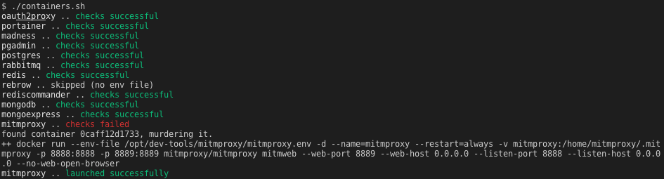

# Development Tool Containers

Random tools for my development environment with a script to launch them using docker, because docker-compose is pretty inflexible and occasionally I want to run some additional configuration inside the container instead of maintaining my own Dockerfiles (yeah I know this kind of goes against the point of containerisation, sue me).

Currently includes:
* [portainer](https://www.portainer.io/): web UI for container management
* [oauth2proxy](https://github.com/oauth2-proxy/oauth2-proxy): authentication provider
* [madness](https://github.com/DannyBen/madness): markdown2html server
* [rabbitmq](https://www.rabbitmq.com/): messaging system
* [redis](https://redis.io/): data-struct/cache server
* [rebrow](https://github.com/marians/rebrow): web UI for Redis
* [rediscommander](https://github.com/joeferner/redis-commander): web UI for Redis
* [mongodb](https://www.mongodb.com/): document store/NoSQL DB
* [mongoexpress](https://github.com/mongo-express/mongo-express): web UI for MongoDB
* [postgres](https://www.postgresql.org/): PostgreSQL is better than MySQL
* [pgadmin](https://www.pgadmin.org/): web UI for PostgreSQL
* [crontabui](https://github.com/alseambusher/crontab-ui): web UI for crontab

Oh, and there's probably some other nonsense in here, too.

## Assumptions

I'm hoping you don't just run these utilties blindly. I'm assuming:

* You will review the env files and nginx files to ensure you are happy with them
* You will check that the containers specified in `containers.sh` are still maintained
* You will only run this for for a **development environment**

# Usage

## Individual containers

These instructions can be repeated for every container you want to use:

1. Create environment and review files:
   ```bash
   cp pgadmin/pgadmin.env.example pgadmin/pgadmin.env
   vim pgadmin/pgadmin.env
   ```
3. At this point you may shoud refresh your containers:
   ```bash
   ./containers.sh
   ```
4. Create and review nginx configuration (if required):
   ```bash
   cp pgadmin/pgadmin.nginx.conf.example pgadmin/pgadmin.nginx.conf
   vim pgadmin/pgadmin.nginx.conf
   ```
5. At this point you may want to reload nginx (if required):
   ```bash
   ./nginx-reload.sh
   ```

## Refresh Containers

After making adjustments to env files you can ensure all containers are running with:
```
./containers.sh
```
This script does the following (for every `create_container` command within):
* Checks if `container` is running, recreates if it is not
* Runs a command to test if the service is responding, recreates if it fails
* Creates the container with the arguments supplied to `create_container`<br>
  *(and few additional/default options are supplied, see `functions.sh` for details)*
* Runs `container/inside.sh` inside the container (via `docker cp` & `docker exec`)
* Runs `container/outside.sh` outside the container

If `container/container.env` does not exist the script will skip over it. Ouput should look something like this:



## Reload nginx

After making adjustment to nginx configurations you can update your nginx include with:
```
./nginx-reload.sh
```
This script does the following:
1. Gets all nginx configurations from `*/*.nginx.conf`
3. Updates the nginx include file (`/etc/nginx/includes/dev-tools.conf`)
4. Runs `nginx -t` to test the configuration (reverting changes if failure is detected)
5. Restarts nginx with `systemctl restart nginx`

This assumes that you include `includes/dev-tools.conf` from your nginx configuration.
